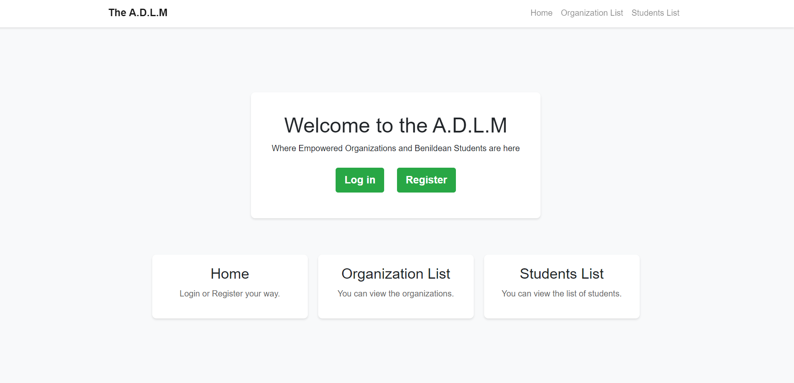
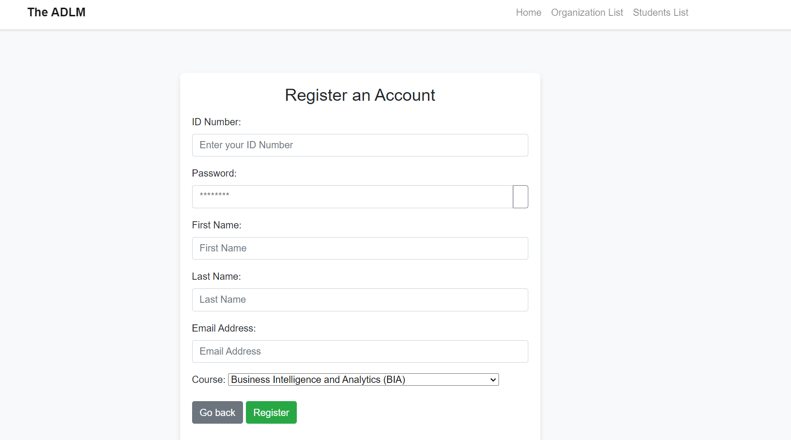
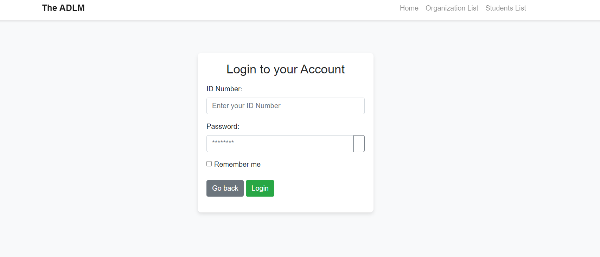
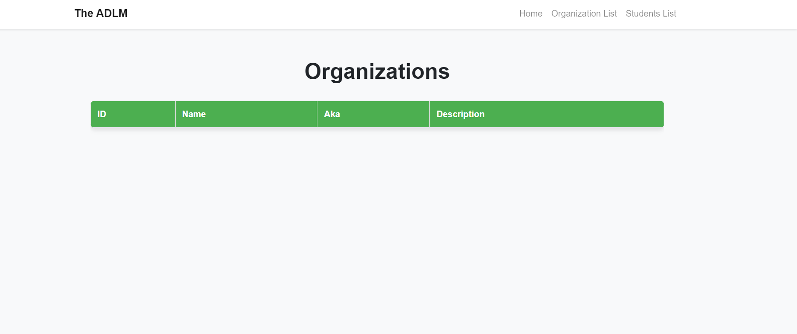
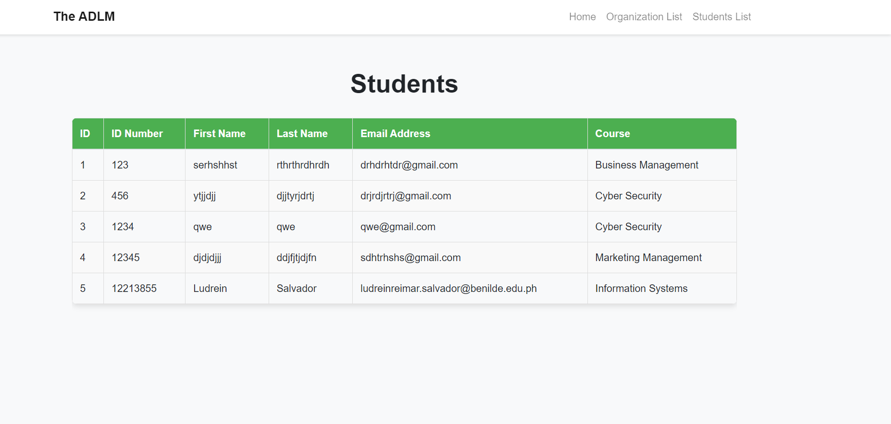

# Student Organization Website | Web Development Finals Project

A web application for managing student organizations and their members. This platform provides functionality for student registration and organization management.

## Application Preview

### Homepage & Navigation


### Registration Page


### Login Page


### Student Organization Registration


### Organization List


### Student List


## Technology Stack

- **Backend**: Node.js with Express.js framework
- **Frontend**: EJS templating engine
- **Database**: SQLite (school.db)
- **Styling**: CSS3 with custom stylesheets
- **Architecture**: MVC (Model-View-Controller) pattern

## Project Structure

```
student-orgsite/
├── bin/
│   └── www                          # Server startup script
├── controllers/
│   ├── organization.controller.js   # Organization business logic
│   └── student.controller.js        # Student business logic
├── database/
│   └── school.db                    # SQLite database file
├── documentation/
│   ├── the-adlm-webdev-finals-1.png # Application screenshots
│   ├── the-adlm-webdev-finals-2.png
│   ├── the-adlm-webdev-finals-3.png
│   ├── the-adlm-webdev-finals-4.png
│   ├── the-adlm-webdev-finals-5.png
│   └── the-adlm-webdev-finals-6.png
├── models/
│   ├── index.js                     # Database connection setup
│   ├── organization.model.js        # Organization data model
│   └── student.model.js             # Student data model
├── public/
│   └── stylesheets/
│       └── style.css                # Application styles
├── routes/
│   ├── index.js                     # Main routes
│   ├── organizations.js             # Organization routes
│   ├── students.js                  # Student routes
│   └── users.js                     # User authentication routes
├── views/
│   ├── error.ejs                    # Error page template
│   ├── index.ejs                    # Homepage template
│   ├── login.ejs                    # Login page template
│   ├── organizations.ejs            # Organizations page template
│   ├── register.ejs                 # Registration page template
│   └── students.ejs                 # Students page template
├── app.js                           # Main application file
├── package.json                     # Project dependencies
└── package-lock.json               # Dependency lock file
```

## Installation & Setup

### Prerequisites
- Node.js (v14 or higher)
- npm (Node Package Manager)

### Installation Steps

1. **Clone the repository**
   ```bash
   git clone https://github.com/ludreinsalvador/student-orgsite.git
   cd student-orgsite
   ```

2. **Install dependencies**
   ```bash
   npm install
   ```

3. **Set up the database**
   The SQLite database (`school.db`) should be automatically created when you first run the application.

4. **Start the application**
   ```bash
   npm start
   ```
   
   Or for development with auto-reload:
   ```bash
   npm run dev
   ```

5. **Access the application**
   Open your browser and navigate to `http://localhost:3000`

## API Endpoints

### Students
- `GET /students` - Get all students
- `POST /students` - Create a new student
- `GET /students/:id` - Get student by ID
- `PUT /students/:id` - Update student
- `DELETE /students/:id` - Delete student

### Organizations
- `GET /organizations` - Get all organizations
- `POST /organizations` - Create a new organization
- `GET /organizations/:id` - Get organization by ID
- `PUT /organizations/:id` - Update organization
- `DELETE /organizations/:id` - Delete organization

### Authentication
- `GET /login` - Login page
- `POST /login` - Process login
- `GET /register` - Registration page
- `POST /register` - Process registration
- `POST /logout` - Logout user

## Features Overview

### Student Management
- Register new students with personal information
- View and edit student profiles
- Search and filter student directory
- Manage student organization memberships

### Organization Management
- Create and manage student organizations
- Add organization details and descriptions
- Assign students to organizations
- Track organization activities and members

### User Authentication
- Secure user registration and login
- Session management
- Password protection
- User role management

## Contributors

- **Alfel Criste**
- **Djan Ocampo**
- **Mark Quiazon**
- **Ludrein Salvador**

## Usage

1. **Registration**: New users can register through the registration page
2. **Login**: Existing users can log in with their credentials
3. **Dashboard**: Access the main dashboard to navigate between features
4. **Students**: Add, view, edit, and manage student records
5. **Organizations**: Create and manage student organizations
6. **Profile Management**: Update user profiles and settings

## Security Features

- Password encryption and secure authentication
- Session management
- Input validation and sanitization
- SQL injection protection
- XSS protection

## License

This project is developed for educational purposes as part of a Web Development course.

## Support

For any questions or issues, please contact the development team or create an issue in the repository.

---

**Note**: This is a student project developed for educational purposes.
